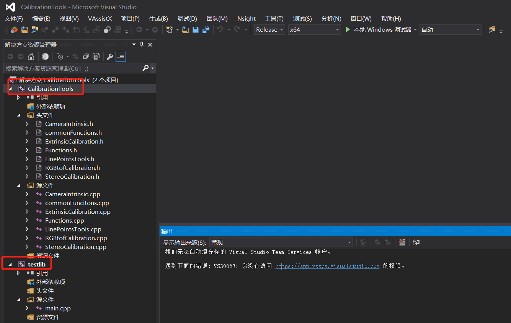
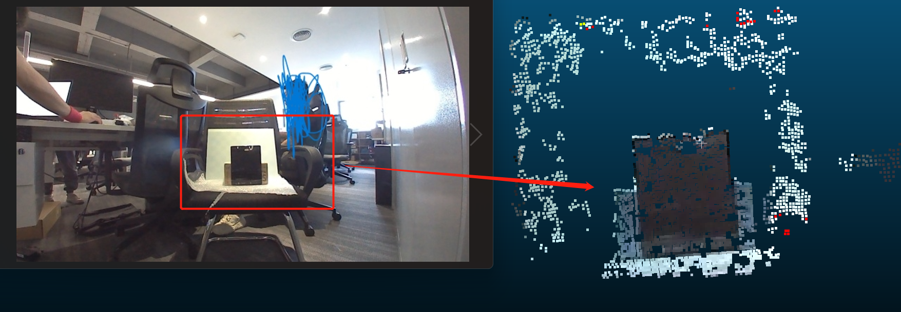

# 视觉相机标定工具

**author:** 

xiaoxiong

**brief：**

1. 相机模型标定（鱼眼相机，普通相机），图像矫正，棋盘格外参估计
2. 立体相机标定与极线矫正
3. RGB(/灰度)相机与深度相机（tof）标定，数据融合（生成彩色或灰度点云）
4. 外参标定

**dependence：**

> 工程环境：

vs2015；opencv454；pcl1.8.0

**usage：**

> 使用方法：

1. 编译CalibrationTools生成lib
2. 在testlib工程中进行测试



**注：有bug或其他问题可以通过邮箱或issue沟通。**


本工程提供的标定工具：

## 一、相机内参标定

**描述：**

使用棋盘格（圆点棋盘格，方形棋盘格）对相机（普通相机、鱼眼相机）进行内参标定。

**表现：**

640X480图像，角点重投影误差为RMS：0.00942731pixel

**接口：**

```c++
/*
brief:相机内参标定类：
初始化:#pragma once
#include <string>
#include <iostream>
#include <vector>
#include <Eigen/dense>
#include <opencv2/highgui/highgui.hpp>
#include <opencv2/imgproc/imgproc.hpp>
#include <opencv2/core/core.hpp>
#include <opencv2/opencv.hpp>
#include <opencv2/calib3d.hpp>

/*
brief:相机内参标定类：
初始化:
1. 所有用于标定的图片名称路径
2 .标定chart的大小以及物理间隔
3. 所使用棋盘格的类型（圆点还是棋盘格）
4. 相机类型(鱼眼还是普通相机)
*/
class CameraIntrinsic
{
public:
	CameraIntrinsic(); //默认构造函数
	CameraIntrinsic(std::string filename); //内参文件名称
	~CameraIntrinsic();


	bool readCameraIntrinsic(std::string filename);
	bool saveCameraIntrinsic(std::string filename);
	//设置计算参数
	void setMaxReproectionError(float error) { m_MaxReporjectionError = error; }
	void setParameters(std::vector<std::string> filenames, 
		cv::Size imageSize, cv::Size patternSize, cv::Size2f patternLength, bool isCricle = false, 
		bool isfisheye = false, bool complexCameraModel = false);
	void printAllParameter() const;

	//求解一个棋盘格的外参
	bool getCheckBoardPose(const cv::Mat&inputImage, Eigen::Matrix4d& matrixCheck2Cam);
	bool compute(bool isvisible = true);//是否显示计算的角点
	bool isCalibrated() const{ return m_isLoadCameraIntrinsic; }//是否已经加载了标定文件
	
	//根据相机模型对图像进行矫正
	void getUndistoredImage(const cv::Mat& input, cv::Mat& output) const;
	//根据相机模型对像素点进行矫正
	void getUndistoredPixels(const std::vector<cv::Point2f>& input, std::vector<cv::Point2f>& output) const;

	//返回计算参数
	cv::Size getPatternSize() const {
		return m_patternSize;
	}
	cv::Size getCornerROISize() const {
		return m_cornerROISize;
	}
	cv::Size2f getPatternLength() const
	{
		return m_patternLength;
	}


private:
	//计算当前图像的角点并且将结果（m_detectResults）和角点（m_calibImagePoint）信息存储起来
	bool getCheckBoardCorners(const cv::Mat&inputImage, cv::Mat& grayImage, bool isvisible);

public:
	cv::Size m_imageSize;//图像大小
	std::vector<std::vector<cv::Point3f>> m_calibWorldPoint;//物理坐标点
	std::vector<std::vector<cv::Point2f>> m_calibImagePoint;//棋盘格角点
	cv::Mat m_cameraMatrix;//      内参
	cv::Mat m_distCoeffs_fisheye;//鱼眼相机畸变
	cv::Mat m_distCoeffs;//        相机畸变
	std::vector<bool> m_detectResults;//角点检测是否成功
	bool m_isfisheye;//使用的是鱼眼参数模型

private:
	//复杂相机模型参数
	bool m_complexCameraModel;
	//标定过程参数
	bool m_isLoadCameraIntrinsic;
	std::vector<std::string> m_filenames;
	cv::Size m_patternSize;//角点布局
	cv::Size m_cornerROISize;//
	cv::Size2f m_patternLength;//两个角点之间的物理距离(15, 15)
	bool m_iscircle;//使用圆点标定板进行角点检测
	
	


	//预先估算的最大重投影误差
	float m_MaxReporjectionError;
	float m_reprojectionError;//重投影误差

};


1. 所有用于标定的图片名称路径
2 .标定chart的大小以及物理间隔
3. 所使用棋盘格的类型（圆点还是棋盘格）
4. 相机类型(鱼眼还是普通相机)
*/
class CameraIntrinsic
{
public:
	CameraIntrinsic(); //默认构造函数
	CameraIntrinsic(std::string filename); //内参文件名称
	~CameraIntrinsic();


	bool readCameraIntrinsic(std::string filename);
	bool saveCameraIntrinsic(std::string filename);
	//设置计算参数
	void setMaxReproectionError(float error) { m_MaxReporjectionError = error; }
	void setParameters(std::vector<std::string> filenames, 
		cv::Size imageSize, cv::Size patternSize, cv::Size2f patternLength, bool isCricle = false, 
		bool isfisheye = false, bool complexCameraModel = false);
	void printAllParameter();
	bool compute(bool isvisible = true);//是否显示计算的角点
	bool isCalibrated() { return m_isLoadCameraIntrinsic; }//是否已经加载了标定文件
	//畸变矫正
public:
	cv::Size m_imageSize;//图像大小
	std::vector<std::vector<cv::Point3f>> m_calibWorldPoint;//物理坐标点
	std::vector<std::vector<cv::Point2f>> m_calibImagePoint;//棋盘格角点
	cv::Mat m_cameraMatrix;//      内参
	cv::Mat m_distCoeffs_fisheye;//鱼眼相机畸变
	cv::Mat m_distCoeffs;//        相机畸变
	std::vector<bool> m_detectResults;//角点检测是否成功

private:
	//复杂相机模型参数
	bool m_complexCameraModel;
	//标定过程参数
	bool m_isLoadCameraIntrinsic;
	std::vector<std::string> m_filenames;
	cv::Size m_patternSize;//角点布局
	cv::Size m_cornerROISize;//
	cv::Size2f m_patternLength;//两个角点之间的物理距离(15, 15)
	bool m_iscircle;//使用圆点标定板进行角点检测
	bool m_isfisheye;//使用的是鱼眼参数模型
	


	//预先估算的最大重投影误差
	float m_MaxReporjectionError;
	float m_reprojectionError;//重投影误差

};

```


## 二、立体相机标定与极线矫正

**描述：**

在相机标定的基础上增加立体标定以及立体矫正

**注：**

鱼眼相机还没有验证

**接口：**

```C++
#pragma once
#include"commonFunctions.h"

class StereoCalibration
{
public:
	StereoCalibration();
	StereoCalibration(std::string stereoModelFileName, std::string leftCameraModel, std::string rightCameraModel); //内参文件名称
	~StereoCalibration();

	bool readStereoModel(std::string stereoModelFileName, std::string leftCameraModel, std::string rightCameraModel);
	bool saveStereoModel(std::string filename);
	bool compute();
	bool rectifyImage(const cv::Mat& left, const cv::Mat& right, cv::Mat& rectifyImageL, cv::Mat& rectifyImageR, bool showRecticfyFlag = false);


	CameraIntrinsic m_leftCamera;
	CameraIntrinsic m_rightCamera;
	cv::Mat m_R, m_T, m_E, m_F, m_RFirst, m_RSec, m_PFirst, m_PSec, m_Q;

private:
	bool m_isLoadStereoModel;
	std::vector<std::vector<cv::Point2f>> m_imagePointsFirst, m_imagePointsSec;
	std::vector<std::vector<cv::Point3f>> m_ObjectPoints;
	cv::Rect m_validRoi[2];
	cv::Size m_imageSize;
	double m_rms = 0;

	bool m_RectifyMapFlag;//是否已经生成矫正map
	cv::Mat m_rmapFirst[2];
	cv::Mat m_rmapSec[2];

};


```


## 三、RGB（/灰度）相机与深度相机（tof）标定，数据融合

**描述：**

对两个相机进行标定，主要使用SVD算法求解两个相机之间的变换矩阵。

提供标定接口和融合接口，通过变换矩阵得到融合数据。

**表现：**

RGB640X360 内参标定误差为：0.00894766pixel（角点的重投影误差的平均值）

tof220X170 内参标定误差为：0.0117507pixel（角点的重投影误差的平均值）

工作范围内两个相机的标定误差为(两个相机之间对应角点L2平均值）：0.312678mm

**注：**

逻辑不全但是能用

**接口：**

```C++
#pragma once
#include"commonFunctions.h"

class RGBtofCalibration
{
public:
	RGBtofCalibration();
	RGBtofCalibration(std::string fileName);
	~RGBtofCalibration();

	//设置计算参数
	void setCheckBoardParam(cv::Size patternSize, cv::Size2f patternLength, bool isCricle = false);
	void setParametersRGB(const std::vector<std::string>& RGBpics, 
		cv::Size imageSize, float maxReprojectError, bool isfisheye = false, bool complexCameraModel = false);
	void setParameterstof(const std::vector<std::string>& TOFpics, 
		cv::Size imageSize, float maxReprojectError, bool isfisheye = false, bool complexCameraModel = false);
	bool calibrateCams(bool isvisible = true);
	bool compute();
	void getPointCloudWithColor(const cv::Mat& rgb, const cv::Mat& depth, pcl::PointCloud<pcl::PointXYZRGB>& ouputcloud,std::string savepath);
	bool saveParameters(std::string saveName);
	bool loadParameters(std::string fileName);

public:
	cv::Size m_imageSizeRGB;//图像大小
	cv::Size m_imageSizetof;//图像大小
	std::vector<std::vector<cv::Point3f>> m_calibWorldPoint;//物理坐标点
	std::vector<std::vector<cv::Point2f>> m_calibImagePointRGB;//棋盘格角点
	std::vector<std::vector<cv::Point2f>> m_calibImagePointtof;//棋盘格角点
	std::vector<Eigen::Vector3f> m_PointSetRGB;
	std::vector<Eigen::Vector3f> m_PointSettof;

	cv::Mat m_cameraMatrixRGB;//      内参
	cv::Mat m_cameraMatrixtof;//      内参
	cv::Mat m_distCoeffs_fisheyeRGB;//鱼眼相机畸变
	cv::Mat m_distCoeffs_fisheyetof;//鱼眼相机畸变
	cv::Mat m_distCoeffsRGB;//        相机畸变
	cv::Mat m_distCoeffstof;//        相机畸变
	std::vector<bool> m_detectResultsRGB;//角点检测是否成功
	std::vector<bool> m_detectResultstof;//角点检测是否成功


private:
	//复杂相机模型参数
	bool m_complexCameraModelRGB;
	bool m_complexCameraModeltof;
	//标定过程参数
	//bool m_isLoadCameraIntrinsicRGB;
	//bool m_isLoadCameraIntrinsictof;
	std::vector<std::string> m_filenamesRGB;
	std::vector<std::string> m_filenamestof;

	cv::Size m_patternSize;//角点布局
	cv::Size2f m_patternLength;//两个角点之间的物理距离(15, 15)
	bool m_iscircle;//使用圆点标定板进行角点检测

	cv::Size m_cornerROISizeRGB;//
	cv::Size m_cornerROISizetof;//
	bool m_isfisheyeRGB;//使用的是鱼眼参数模型
	bool m_isfisheyetof;//使用的是鱼眼参数模型

	float m_MaxReporjectionErrorRGB;//预先估算的最大重投影误差
	float m_MaxReporjectionErrortof;//预先估算的最大重投影误差
	float m_reprojectionErrorRGB;//重投影误差
	float m_reprojectionErrortof;//重投影误差

	//点集
	std::vector<Eigen::Vector3f> m_RGBPointSet;
	std::vector<Eigen::Vector3f> m_tofPointSet;
	//结果
	Eigen::Matrix4f m_transformation_matrix;
	float m_AverageErrorDistance;
};

```

**效果图：**



## 四、线激光标定

不开源

## 五、外参标定

1. 基于点云标定（主要为线激光点云）
2. 基于图像标定（标定相机与结构之间的关系）

```c++
#pragma once
#include "CameraIntrinsic.h"
#include "LineLightPlaneCalibration.h"
#include "StereoCalibration.h"
#include "RGBtofCalibration.h"

//基于点云标定
//分割出地面数据后，得到当前点云回到地面到Z=0处的变换矩阵（地面是Z值方向）
bool getBackToGroundTransformation(
	const pcl::PointCloud<pcl::PointXYZ>& cloudin,
	float minH, float maxH, float minD, float maxD, float maxOutliersDis,
	Eigen::Matrix4f& T);


//基于图像标定
/*
计算棋盘格到机器人的变换矩阵需要的参数
roll,pitch,yaw: 单位：角度deg
x,y,z: 单位：米m
*/
struct StructureParam
{
	double roll;
	double pitch;
	double yaw;
	double x;
	double y;
	double z;
};

//格式转换
void getTransformationFormRPYNXYZ(StructureParam param, Eigen::Matrix4d& transformationMatrix);

//通过计算相机到棋盘格的变换矩阵，以及已知的棋盘格到机器人（结构）变换矩阵(需要手动测量)，得到相机到机器人的变换矩阵
bool CalibCam2Robot(CameraIntrinsic& cam, const cv::Mat& inputImage, StructureParam check2RobotParam, Eigen::Matrix4d& matrixCam2Robot);


```

## 六、基于双目的自标定

TODO


# 测试

//测试相机内参标定
void testCameraIntrinsic1();
//测试立体标定
void testStereoCalibaration1();
//测试立体矫正
void testStereoRectify();
//测试RGB相机与TOF深度数据融合
void testRGBtofCalibration();
//点云标定到地面
void rectifyPC2floor();

